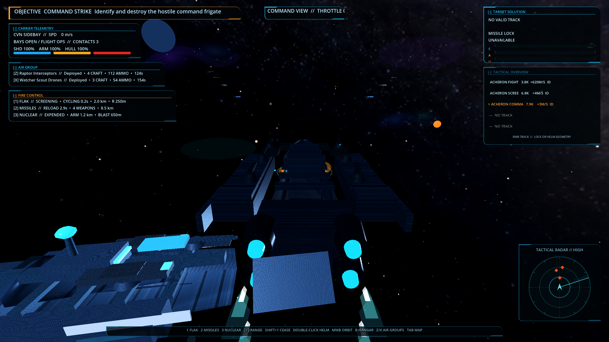

# EXODRIFT: Carrier Command

> Pilot the flagship. Command the fleet. Survive the deep strike.



`EXODRIFT: Carrier Command` is a single-player Godot 4 action-RTS for PC and Web. Directly pilot a heavy carrier, launch fighters and drones from mirrored side bays, and command persistent wings and capital escorts through a live three-dimensional tactical map. Time never pauses when command mode opens.

[Play the browser build](web/play/) · [Read the game bible](GAME_BIBLE.md) · [View the showcase site](web/)

The public title is provisional. `Project Sidebay` remains the internal codename used by some runtime classes and stable IDs.

## Current playable

- Heavy carrier flight with persistent throttle and inertia, carrier-relative placed flak screens, four-missile guided salvos, one nuclear torpedo per battle, visible automated defense, and shields → armor → hull damage.
- A unified command-interface style groups carrier telemetry, air-group state, fire control, target data, radar, notifications, and controls into compact scalable panels. The four primary command panels and tactical overview are collapsible.
- A four-craft Raptor interceptor wing, three Watcher scout drones, and the commandable missile frigate `ISS Resolute`.
- Visible launch, engagement, recall, side-bay recovery, servicing, relaunch, and armored bay-retraction cycles with a closed-bay jump interlock.
- A seam-feathered galaxy-arm panorama blended into the shader-driven deep-space sky, retaining sector palettes, procedural stars, foreground parallax, and a pulsing tactical radar.
- Refit capital ships with faction-specific hull atlases, layered plating, modeled hardpoints, recognition lighting and wear; low-node fighter geometry, pooled combat flashes, missile exhaust, shield/hull feedback, and saved Low/Medium/High graphics profiles remain shared by Windows and Web.
- Strict sensor fog with uncertain contacts, active emissions, identification requirements, stale tracks, and command-link loss.
- Live 3D fleet command with selection, move, attack, intercept, escort, hold, recall, withdraw, stances, formations, and queued orders.
- An 18-node, three-sector run map with fuel, supplies, intel, forecasts, combat transitions, and manual versioned saves.
- Persistent carrier condition, 240-person crew, eight damageable subsystems, finite combat/aviation stores, damage-control spares, wing losses and packages, escort survival, exact fleet-service actions, and five authored module slots.
- Three fixed escort identities with requisition acquisition, sector-gated suppliers, reserve selection, unique permanent losses, and distinct tactical profiles.
- Three carrier-frame sidegrades and three refittable air-group complements with fixed 4/3, 5/2, and 3/4 interceptor/scout allocations.
- Persistent salvage stock with fixed supply, fuel, and requisition conversions plus three route logistics postures with explicit travel tradeoffs.
- Six objective types: command strike, interception, extraction, defense, escort, and capture.
- Withdrawal pursuit, jump-range stragglers, recoverable escape pods, and an after-action rescue/salvage/departure choice with persistent consequences.
- A compact bottom command row over a continuously simulated battle built from the current textured runtime ships and fighters, with New Operation, Continue, a nine-part animated communications tutorial, persistent settings, credits, and return-to-title navigation.
- A seven-step first-operation orientation that teaches helm translation, active sensors, flight operations, carrier engineering, the live tactical map, and intent-level orders without pausing combat.
- Three sector-specific hostile fleets—Acheron, Vesper, and Crucible—with different capital roles, fighter complements, opening formations, weapons, pursuit identities, and battlefield palettes.
- Three deterministic layouts per sector plus bespoke command battles: Acheron command-net screening, Vesper shield-break pincers, and the Crucible's anchored multi-phase strategic core.
- Textured, layered capital ships with faction hull plating, tapered armor, command towers, bridge windows, sensor masts, visible turrets, housed engines, and navy/raider/alien silhouette language.
- Named escorts and fighter classes use role-specific geometry, faction projectile palettes, engine trails, progressive breach indicators, damage sparks, and brighter fleet lighting for at-a-glance combat identification.
- Twelve persistent named officers across six departments, with assignments, tactical effects, traits, bonds, injuries, rescue, recovery, succession, and permanent death.
- Supply-funded treatment, earned promotions, requisition recruitment, rare officer unlocks, and ten deterministic operational events with authored radio and relationship outcomes.
- Adaptive three-sector procedural music, combat-pressure layering, faction-aware effects, and encounter-phase radio stingers with independent Master/Music/SFX controls.
- Atomic autosaves with a recoverable backup, corrupt-save fallback, New Operation confirmation, persistent keyboard remapping, and an in-game playtest debrief that exports structured telemetry and tester prompts.

## Run locally

Open the project in Godot 4 and press **F5**, or run:

```powershell
godot --path .
```

The packaged Windows build is generated at `build/ProjectSidebay.exe`. The GitHub Pages artifact lives in `web/`; the playable Godot export is nested under `web/play/` so the repository can present a full showcase page first.

## Controls

All listed keyboard actions can be remapped from **Settings → Remap Controls**.

- `W/S`: increase/decrease persistent throttle; `Ctrl`: full stop; `Shift`: boost
- Mouse: visible unified command cursor; double-click empty space for a full-cruise heading, middle-drag to orbit, and use the wheel for signed zoom. The authored carrier framing is 0%; the camera can zoom farther out to -100% or in to +100%.
- `1`: enter or relocate the carrier-centered flak-screen placement view from direct combat or the tactical overlay; left-click confirms, right-click or `Esc` cancels, and `Shift+1` ceases the active screen. `[`/`]` adjust its 1.0–3.2 km fuse distance in 250 m steps; the flak-director upgrade extends the maximum to 4 km.
- `2`: fire a four-weapon guided missile salvo at the identified lock. Right mouse remains a compatibility shortcut.
- `3`: fire the single 10 km nuclear torpedo. It arms after 1.2 km, has a 650 m falloff blast, can be intercepted, and damages friendlies.
- `P`: active sensor ping
- `C`: open the live, non-pausing Carrier Operations console for reactor allocation, subsystem triage, damage-control assignments, crew/stores, deck priorities, and wing packages
- `Z`, `X`: launch/recall interceptor and scout wings; pressing during servicing queues an automatic physical redeploy when turnaround completes
- `B`: deploy/open both hangar wings, or recall both air groups and retract the galleries once recovery is complete
- `Tab`: live tactical map
- Tactical map: `F1–F4` groups, `1` flak placement, left-click select/confirm, right-click context order/cancel, `I` intercept, `E` escort carrier, Shift queue, `Q` stance, `F` formation, `R` recall, `H` hold, `X` withdraw, middle-drag orbit, wheel zoom
- Tactical overview: select the carrier, then right-click an identified contact marker or overview row for Lock, Approach 500 m, Orbit, Keep at Distance, or Clear Relative Navigation. Orbit and Keep offer 500 m, 5 km, 10 km, and 25 km distances; empty-space and wing/escort right-click orders retain their existing behavior.
- `V`: begin jump preparation and wing recall; press again to emergency-seal the bays and risk stragglers
- `Esc`: pause/settings; `Enter`: restart or return to the campaign

## Tests and exports

```powershell
godot --headless --path . --script tests/run_tests.gd
godot --headless --path . --script tests/run_integration.gd
godot --headless --path . --script tests/run_campaign_tests.gd
godot --headless --path . --script tests/run_m15_encounter_tests.gd
godot --headless --path . --script tests/run_playtest_tests.gd
godot --headless --path . --script tests/run_save_settings_tests.gd
godot --headless --path . --script tests/run_ship_readability_tests.gd
godot --headless --path . --script tests/run_audio_narrative_tests.gd
godot --headless --path . --script tests/run_eve_flight_control_tests.gd
godot --headless --path . --script tests/run_main_menu_layout_tests.gd
godot --headless --path . --script tests/run_ship_surface_tests.gd
godot --headless --path . --script tests/run_space_hud_readability_tests.gd
godot --headless --path . --script tests/run_ordnance_screen_tests.gd
godot --headless --path . --script tests/run_tutorial_tests.gd
godot --headless --path . --script tests/run_carrier_operations_state_tests.gd
godot --headless --path . --script tests/run_carrier_combat_integration_tests.gd
godot --headless --path . --script tests/run_deck_logistics_tests.gd
godot --headless --path . --script tests/run_carrier_operations_ui_tests.gd
godot --headless --path . --script tests/run_carrier_service_ui_tests.gd
godot --headless --path . --script tests/profile_combat_stress.gd
godot --path . --script tests/profile_menu.gd
godot --headless --path . --export-release "Web"
godot --headless --path . --export-release "Windows Desktop"
```

The M19 automated combat gate measures 145.0 effective FPS at 2560×1440 with p95 7.50 ms and p99 7.72 ms. The sustained carrier-incident/all-wings/ordnance stress gate measures 145.0 effective FPS at 2560×1440 with p95 10.14 ms and p99 10.60 ms while keeping nodes and the 80-slot VFX pool bounded; the full-runtime-model menu measures 144.9 effective FPS. These are development RTX 3060 measurements. See [GAME_BIBLE.md](GAME_BIBLE.md) for acceptance evidence and hardware-target caveats.

## GitHub Pages

The checked-in workflow at `.github/workflows/deploy-pages.yml` publishes `web/` when the site changes. In the repository’s **Settings → Pages**, select **GitHub Actions** as the source, then run the workflow or push to `main`.

All currently defined milestones M1–M19 are implemented. M19 adds live carrier engineering triage, persistent crew and subsystem consequences, finite magazines and aviation stores, explicit per-bay service queues, six data-driven wing packages, exact campaign service actions, and the non-pausing Carrier Operations console. External first-time-player sessions and release hardening are the next gate.
